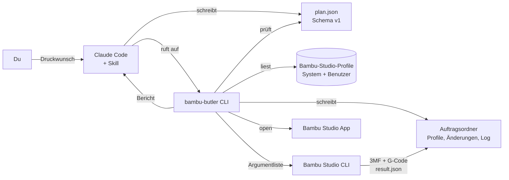

<div align="center">

# 🖨️ Bambu Butler

**Druckwünsche in natürlicher Sprache → geprüfter Druckplan → geslictes Bambu-Studio-Projekt.**

<!-- Projekt -->
[](https://github.com/pepperonas/bambu-butler/actions/workflows/ci.yml)
[](CHANGELOG.md)
[](LICENSE)
[](https://ghloc.vercel.app/pepperonas/bambu-butler?branch=main)
[](tests/)

<!-- Technik -->
[](https://www.python.org/)
[](https://docs.astral.sh/uv/)
[](https://docs.astral.sh/ruff/)
[](https://typer.tiangolo.com/)
[](https://docs.pydantic.dev/)

<!-- Kompatibilität -->
[](docs/features.md)
[-000000?logo=apple&logoColor=white)](#plattformen)
[](.claude/skills/bambu-butler/SKILL.md)
[](#architektur)
[](#architektur)

<!-- Unterstützen -->
[](https://www.paypal.com/donate/?business=martin.pfeffer@celox.io&item_name=Bambu+Butler&currency_code=EUR)
[](https://g.page/r/CXgdRV3QysvxEBM/review)
[](https://github.com/pepperonas/bambu-butler/stargazers)

</div>

---

Bambu Butler ist ein lokales Kommandozeilenwerkzeug plus eine [Claude-Code-Skill](.claude/skills/bambu-butler/SKILL.md).
Du beschreibst in Claude Code, was du drucken willst. Claude übersetzt das in einen versionierten
JSON-Druckplan. Bambu Butler prüft den Plan gegen deine **echten Bambu-Studio-Profile**, erzeugt
projektspezifische Profilkopien, ruft die **Bambu-Studio-CLI** zum Slicen auf und öffnet das Ergebnis
in der App.

```text
> Bereite halter.stl für meinen Bambu Lab A1 mini mit PLA vor. Die Halterung soll stabil sein,
  eine saubere sichtbare Oberfläche haben und möglichst wenig Support benötigen.
```

- **Kein MCP, kein eigener KI-API-Zugang.** Claude Code ist die KI; das Python-Paket enthält kein Sprachmodell.
- **Lokal.** Keine Cloud-Dienste, keine Anmeldung, keine Telemetrie.
- **Nachvollziehbar.** Jeder Auftrag bekommt einen Ordner mit Plan, aufgelösten Profilen, Änderungsliste, exaktem CLI-Aufruf, Log und Bericht.
- **Ehrlich.** Druckzeit und Filamentverbrauch stammen ausschließlich aus echter Slicer-Ausgabe.
- **Sicher.** Kein Befehl startet jemals einen physischen Druck.

## Inhalt

- [Status](#status)
- [Schnellstart](#schnellstart)
- [Mit Claude Code nutzen](#mit-claude-code-nutzen)
- [Architektur](#architektur)
- [Befehle](#befehle)
- [Der Druckplan](#der-druckplan)
- [Auftragsordner](#auftragsordner)
- [Konfiguration und Pfade](#konfiguration-und-pfade)
- [Plattformen](#plattformen)
- [Funktionsumfang](#funktionsumfang)
- [Einschränkungen](#einschränkungen)
- [Fehlerbehebung](#fehlerbehebung)
- [Entwicklung](#entwicklung)
- [Unterstützen](#unterstützen)
- [Lizenz](#lizenz)

## Status

**Version 0.0.1 – erste nutzbare Version.**

Verifiziert am 30.09.2026 auf einem MacBook Pro (Apple Silicon) mit **Bambu Studio 02.08.02.61**:

| Schritt | Ergebnis |
|---|---|
| `bambu-butler doctor --strict` | Executable, Version (aus `Info.plist`), CLI-Optionen, 202 Druckerprofile, 596 Prozessprofile, 2 237 System- und 11 Benutzer-Filamentprofile erkannt |
| `bambu-butler slice examples/a1mini-pla-wandhalter.plan.json` | Status `sliced`: 3MF mit G-Code erzeugt, **42 min 21 s**, **11,26 g** PLA (aus `Metadata/slice_info.config`) |
| `uv run pytest` | 77 Tests bestanden (macOS und Linux) |

Die Bambu-Studio-CLI hat die von Bambu Butler erzeugten, vollständig aufgelösten Profilkopien
(`from: User`, `inherits: <Systemprofil>`) ohne Anpassung akzeptiert. Die Einstellungen aus dem Plan
(4 Wände, 25 % Gyroid, Naht hinten, 4 Bodenschichten, Auto-Brim) wurden übernommen.

Noch nicht auf echter Hardware geprüft: `prepare` (ungeslicter 3MF-Export), `open`, der macOS-GUI-Adapter,
3MF-Mehrfarbprojekte sowie Windows und Linux. Details: [`docs/features.md`](docs/features.md).

## Schnellstart

Voraussetzungen: macOS, [Bambu Studio](https://bambulab.com/de/download/studio), Python 3.11+ und
[uv](https://docs.astral.sh/uv/) (`brew install uv`).

```bash
git clone https://github.com/pepperonas/bambu-butler.git
cd bambu-butler
uv sync
uv run pytest -q
uv tool install --from . bambu-butler
bambu-butler doctor --strict
```

Erster Auftrag mit dem mitgelieferten Demo-Modell:

```bash
cd examples
bambu-butler validate a1mini-pla-wandhalter.plan.json
bambu-butler slice a1mini-pla-wandhalter.plan.json --dry-run
bambu-butler slice a1mini-pla-wandhalter.plan.json
bambu-butler open jobs/<zeitstempel>-wandhalter/wandhalter.3mf
```

> **zsh-Hinweis:** Kopiere keine Zeilen mit `# Kommentar` am Ende. zsh übergibt `#` ohne
> `setopt interactivecomments` als Argument (z. B. `ERROR: file or directory not found: #` bei pytest).

Aktualisieren:

```bash
git pull
uv sync
uv tool install --force --from . bambu-butler
```

## Mit Claude Code nutzen

1. `claude` im Repository-Ordner starten. Die Skill unter
   [`.claude/skills/bambu-butler/`](.claude/skills/bambu-butler/SKILL.md) wird automatisch erkannt
   und kann auch explizit mit `/bambu-butler` aufgerufen werden.
2. Den Druckwunsch formulieren:

```text
> Bereite ~/Downloads/halter.stl für meinen Bambu Lab A1 mini mit PLA vor.
  Die Halterung soll stabil sein, eine saubere sichtbare Oberfläche haben
  und möglichst wenig Support benötigen.
```

Claude arbeitet dann die Skill ab:

| Schritt | Befehl | Zweck |
|---|---|---|
| 1 | `bambu-butler --json doctor` | Kann geslict werden? Welche Version? |
| 2 | `bambu-butler --json inspect halter.stl -p "<Drucker>"` | Maße, Einheit, Druckraum, Geometrie |
| 3 | `bambu-butler --json profiles list …` | Passende Drucker-, Prozess- und Filamentprofile |
| 4 | `bambu-butler template …` + Bearbeiten | Plan mit Einstellungen, Begründungen und Annahmen |
| 5 | `bambu-butler --json validate plans/halter.plan.json` | Schema und Kompatibilität |
| 6 | `bambu-butler --json slice plans/halter.plan.json` | Echter Slice-Lauf |
| 7 | Zusammenfassung + `bambu-butler open …` | Ergebnis prüfen, Druck manuell starten |

Rückfragen stellt Claude nur, wenn Entscheidendes fehlt, etwa das Material oder eine Belastungsrichtung,
die die Ausrichtung bestimmt. Die Vorbereitung ist umkehrbar, daher arbeitet Claude dort selbstständig.
**Vor einem physischen Druckstart ist immer deine ausdrückliche Freigabe nötig**, und in 0.0.1 gibt es
dafür ohnehin keine Funktion.

Weitere Beispiele für Druckwünsche:

```text
> Drucke deckel.3mf auf dem A1 mini in PETG, maximale Maßhaltigkeit, Brim nur außen.
> Wie lange würde wandhalter.stl mit 0.16 mm Schichthöhe dauern? Nur slicen, nicht öffnen.
> Nimm mein Benutzerprofil "My Strong" und erhöhe die Wände auf 5.
```

## Architektur



Aufgabenteilung:

- **Claude Code** interpretiert Sprache, wählt Profile, begründet Einstellungen und stellt Rückfragen.
- **Bambu Butler** ist deterministisch und überprüfbar: Profile auflösen, validieren, Dateien schreiben,
  Bambu Studio sicher aufrufen und Ergebnisse auslesen.
- **Bambu Studio** slict. Bambu Butler verändert weder die Installation noch die Originalprofile.

Warum Profile aufgelöst werden: Die Bambu-Studio-CLI löst `inherits` für per `--load-settings` /
`--load-filaments` übergebene Dateien **nicht** auf und verlangt die Felder `type`, `name` und `from`.
Bambu Butler bildet deshalb die Vererbungslogik von `PresetBundle::load_vendor_configs_from_json` nach
(Eltern → `include` → eigene Werte) und übergibt vollständige Profile.

## Befehle

Globale Optionen stehen **vor** dem Unterbefehl: `bambu-butler --json doctor`.
Vollständige Referenz mit allen Optionen und JSON-Ausgaben: [`docs/cli.md`](docs/cli.md).

| Befehl | Zweck |
|---|---|
| `init [ORDNER]` | Arbeitsordner mit `bambu-butler.json`, `jobs/`, `plans/` anlegen |
| `doctor [--strict]` | Bambu Studio, Version, CLI-Optionen, Profile und fehlende Abhängigkeiten prüfen |
| `profiles list [-t TYP] [-p DRUCKER] [-q TEXT] [--vendor V] [--all]` | Profile auflisten, optional nur kompatible |
| `profiles show NAME [-t TYP] [--raw] [-k KEYS]` | Profil mit aufgelöster Vererbung anzeigen |
| `inspect MODELL [-p DRUCKER]` | STL/3MF: Maße, Einheit, Objekte, Metadaten, Geometrie, Druckraum |
| `template MODELL -p DRUCKER [--process P] [-f FILAMENT] [-o DATEI]` | Planvorlage mit Standardprofilen |
| `validate PLAN` | Schema und Kompatibilität mit den vorhandenen Profilen prüfen |
| `prepare PLAN [--dry-run] [--timeout S]` | Auftragsordner und ungeslictes 3MF erzeugen |
| `slice PLAN [--dry-run] [--timeout S]` | Vorbereiten und mit der Bambu-Studio-CLI slicen |
| `open PROJEKT [--dry-run] [--check-gui]` | Projekt in Bambu Studio öffnen |
| `schema [-o DATEI]` | JSON-Schema des Druckplans ausgeben |
| `gui check [--expect NAME]` | macOS: Berechtigungen und Fenster prüfen (keine Klicks) |
| `printer status` | Stand der Druckersteuerung (nicht implementiert) |

Globale Optionen: `--json`, `--studio PFAD`, `--resources PFAD`, `--data-dir PFAD`, `--jobs-dir PFAD`,
`--config DATEI`, `--version`.

**Exit-Codes:** `0` ok · `1` allgemeiner Fehler · `2` Plan ungültig oder inkompatibel ·
`3` Bambu Studio fehlt · `4` Slicer fehlgeschlagen oder Timeout · `5` nicht unterstützt.

Beispielausgabe von `slice`:

```text
╭──────────────────── Status: sliced ────────────────────╮
│ Erfolgreich von Bambu Studio geslict.                  │
╰────────────────────────────────────────────────────────╯
  process.bottom_shell_layers: 3 → 4
  process.brim_type: – → auto_brim
  process.seam_position: aligned → back
  process.sparse_infill_density: 15% → 25%
  process.sparse_infill_pattern: grid → gyroid
  process.wall_loops: 2 → 4
Auftragsordner: …/examples/jobs/20260930-153054-wandhalter
Druckzeit: 42 min 21 s, Filament: 11.26 g (Quelle: 3MF Metadata/slice_info.config)
Es wurde kein Druck gestartet.
```

## Der Druckplan

Eigenes, stabiles Format `bambu-butler/print-plan` Version 1.
Schema: [`schemas/print-plan.v1.schema.json`](schemas/print-plan.v1.schema.json) ·
Beschreibung: [`docs/plan-schema.md`](docs/plan-schema.md) · Beispiele: [`examples/`](examples/).

```json
{
  "schema": "bambu-butler/print-plan",
  "schema_version": "1",
  "request": "Stabile Halterung, saubere Oberfläche, wenig Support",
  "model": {"path": "halter.stl"},
  "printer": {"profile": "Bambu Lab A1 mini 0.4 nozzle", "nozzle_diameter_mm": 0.4},
  "process": {"profile": "0.20mm Standard @BBL A1M"},
  "filaments": [{"profile": "Bambu PLA Basic @BBL A1M", "material": "PLA"}],
  "settings": {
    "quality":  {"seam": "back"},
    "strength": {"wall_loops": 4, "top_layers": 5, "infill_density_percent": 25, "infill_pattern": "gyroid"},
    "support":  {"enabled": true, "style": "tree_auto", "build_plate_only": true},
    "adhesion": {"brim": "auto"}
  },
  "overrides": {"process": {}, "filament": {"nozzle_temperature": 215}, "machine": {}},
  "transform": {"rotate_x_deg": 0, "scale": 1.0, "auto_orient": false, "arrange": true},
  "output": {"job_name": "halter"},
  "assumptions": [{"text": "Last wirkt auf den senkrechten Schenkel.", "reason": "Nicht aus dem Mesh ableitbar."}],
  "rationale": [{"setting": "wall_loops", "value": 4, "reason": "Festigkeit kommt aus den Wänden."}],
  "open_questions": []
}
```

Die freundlichen Einstellungen unter `settings` werden auf Bambu-Studio-Schlüssel übersetzt, die gegen
den Bambu-Studio-Quellcode geprüft sind (`wall_loops`, `sparse_infill_density`, `support_type`,
`brim_type` …). Unter `overrides` sind beliebige weitere Schlüssel erlaubt, sofern sie im
jeweiligen Basisprofil existieren.

Drei Stufen werden ausdrücklich unterschieden:

| Stufe | Bedeutung | Erreicht durch |
|---|---|---|
| Schema-gültig | JSON entspricht dem Schema v1 | `validate` |
| Kompatibel | Profile existieren und passen zusammen (`compatible_printers`), Material und Düse stimmen, Overrides sind bekannte Schlüssel, Schichthöhe in Druckergrenzen, Modell passt in den Druckraum, 3MF-Filament-Slots existieren | `validate` |
| Geslict | Bambu Studio hat 0 zurückgegeben und das 3MF enthält G-Code | `slice` |

Blockierende offene Fragen (`open_questions[].blocking = true`) verhindern `prepare` und `slice`.

## Auftragsordner

```text
jobs/20260930-153054-wandhalter/
├── plan.json          # verwendeter Plan (Kopie)
├── profiles/
│   ├── machine.json   # unverändertes Systemprofil (from: system)
│   ├── process.json   # "0.20mm Standard @BBL A1M [bambu-butler wandhalter]" (from: User)
│   └── filament_1.json
├── changes.json       # jede Änderung gegenüber dem Basisprofil inkl. Quelle im Plan
├── input/             # Kopie des Eingabemodells – das Original bleibt unangetastet
├── command.json       # exakte Argumentliste, Timeout, Versionen
├── cli.log            # stdout/stderr von Bambu Studio
├── result.json        # von Bambu Studio geschrieben
├── wandhalter.3mf     # geslictes Projekt (bei prepare: wandhalter.prepared.3mf)
├── report.md          # Bericht für Menschen
└── report.json        # Bericht für Maschinen
```

`jobs/` ist in `.gitignore` eingetragen.

## Konfiguration und Pfade

Reihenfolge: **CLI-Option > Umgebungsvariable > `bambu-butler.json` > Auto-Erkennung.**

| Wert | CLI-Option | Umgebungsvariable | macOS-Standard |
|---|---|---|---|
| Executable | `--studio` | `BAMBU_BUTLER_STUDIO` | `/Applications/BambuStudio.app/Contents/MacOS/BambuStudio` |
| Ressourcen (Systemprofile) | `--resources` | `BAMBU_BUTLER_RESOURCES` | `/Applications/BambuStudio.app/Contents/Resources` |
| Datenordner (Benutzerprofile) | `--data-dir` | `BAMBU_BUTLER_DATA_DIR` | `~/Library/Application Support/BambuStudio` |
| Auftragsordner | `--jobs-dir` | `BAMBU_BUTLER_JOBS_DIR` | `./jobs` |
| Timeout in Sekunden | `--timeout` | `BAMBU_BUTLER_TIMEOUT` | `600` |
| Konfigurationsdatei | `--config` | `BAMBU_BUTLER_CONFIG` | `bambu-butler.json` im aktuellen oder einem übergeordneten Ordner |

```json
{
  "studio_executable": "",
  "resources_dir": "",
  "data_dir": "",
  "jobs_dir": "jobs",
  "timeout_seconds": 600
}
```

Leere Werte werden automatisch erkannt. `bambu-butler init` erzeugt die Datei.
Zugangsdaten aus `BambuStudio.conf` werden weder gelesen noch ausgegeben.

## Plattformen

| Plattform | Status |
|---|---|
| macOS (Apple Silicon) | ✅ primär, mit Bambu Studio 02.08.02.61 verifiziert |
| macOS (Intel) | ⚠️ sollte funktionieren, ungetestet |
| Windows | ⚠️ Pfaderkennung vorbereitet (`C:\Program Files\Bambu Studio`, `%APPDATA%\BambuStudio`), CI-Tests laufen, Slicen ungetestet |
| Linux | ⚠️ Pfaderkennung vorbereitet (PATH, `/opt`, Flatpak-Datenordner), Tests laufen, Slicen ungetestet |

## Funktionsumfang

Vollständige Übersicht: [`docs/features.md`](docs/features.md).

| Funktion | Status |
|---|---|
| Installation erkennen (`doctor`), Pfade überschreibbar | ✅ verifiziert |
| System- und Benutzerprofile, Vererbung + `include` auflösen | ✅ verifiziert |
| Fehlende Eltern, Zyklen, inkompatible Kombinationen erkennen | ✅ |
| STL (binär/ASCII) und 3MF analysieren inkl. Topologie | ✅ |
| Druckplan-Schema v1, Validierung, Mapping auf geprüfte Bambu-Schlüssel | ✅ |
| Auftragsordner, Änderungsliste, Bericht, Dry-Run, Timeouts, `--json` | ✅ |
| Slicen über die Bambu-Studio-CLI | ✅ verifiziert mit 02.08.02.61 |
| Druckzeit und Filament aus echter Slicer-Ausgabe | ✅ verifiziert |
| Ungeslicter Projekt-Export (`prepare`) | 🧪 implementiert, noch nicht auf echter Installation geprüft |
| Öffnen in Bambu Studio | 🧪 implementiert, noch nicht verifiziert |
| macOS-GUI-Adapter | ⚠️ nur Aktivieren, Fenster und Berechtigungen prüfen |
| Druckersteuerung (senden, starten, pausieren, Temperaturen) | ❌ bewusst nicht implementiert – [`docs/printer-control.md`](docs/printer-control.md) |

## Einschränkungen

- **3MF-Mehrfarbprojekte:** Bambu Butler lädt die Filamente des Plans per `--load-filaments`, die Bambu-CLI
  ersetzt damit die Filamentprofile des Projekts. Ob Farben, Slot-Zuordnungen und AMS-Informationen dabei
  vollständig erhalten bleiben, ist **nicht verifiziert**. Bambu Butler erfindet keine Farb- oder
  AMS-Zuordnungen, warnt bei abweichender Filamentanzahl und bricht ab, wenn Objekte Slots nutzen, die der
  Plan nicht definiert.
- **`compatible_printers_condition`**-Ausdrücke werden nicht ausgewertet; das ergibt eine Warnung statt einer Entscheidung.
- **Mesh-Grenzen:** Belastungsrichtung, optimale Ausrichtung oder Supportbedarf lassen sich aus einem Mesh nicht
  sicher bestimmen. Die Druckraumprüfung ist ein Rechteck-Test ohne Ausschlussbereiche und Brim.
- **Noch nicht im Plan:** Plattentyp (`curr_bed_type`), Einstellungen pro Objekt, Modifier, mehrere Platten.
- **Profilnamen** unterscheiden sich zwischen Bambu-Studio-Versionen (z. B. `Bambu PETG Basic @BBL A1M 0.4 nozzle`).
  Immer mit `profiles list` prüfen.

## Fehlerbehebung

Ausführlich: [`docs/troubleshooting.md`](docs/troubleshooting.md).

| Symptom | Lösung |
|---|---|
| `Bambu Studio wurde nicht gefunden` | `--studio /Pfad/zur/BambuStudio` oder `BAMBU_BUTLER_STUDIO` setzen |
| `Profil nicht gefunden: '…'` | Exakten Namen mit `bambu-butler profiles list -q …` suchen |
| `incompatible_profile` | `profiles list --printer "<Drucker>"` zeigt nur kompatible Profile |
| Exit 4, `CLI_GCODE_PATH_OUTSIDE` | Brim oder Support ragt über das Bett: Modell kleiner, Brim schmaler |
| Exit 4, `slicer_timeout` | `--timeout 1200` oder Modell vereinfachen |
| `ERROR: file or directory not found: #` | zsh-Kommentar mitkopiert – Zeile ohne `# …` ausführen |

## Entwicklung

```bash
uv sync
uv run pytest -q
uv run ruff check src tests
uv run bambu-butler schema -o schemas/print-plan.v1.schema.json   # nach Änderungen an plan.py
```

- Code-Überblick und Regeln: [`CLAUDE.md`](CLAUDE.md)
- Änderungen: [`CHANGELOG.md`](CHANGELOG.md)
- Die Tests brauchen kein Bambu Studio: Sie nutzen synthetische Profile und ein ausdrücklich als
  Test-Double markiertes Fake-Executable (`tests/conftest.py`).
- CI läuft auf macOS, Linux und Windows ([`.github/workflows/ci.yml`](.github/workflows/ci.yml)).

Umfang 0.0.1: rund 3 200 Zeilen Python im Paket, rund 900 Zeilen Tests.

## Unterstützen

Wenn dir Bambu Butler Zeit spart, freue ich mich über einen ⭐ auf GitHub, Feedback in den
[Issues](https://github.com/pepperonas/bambu-butler/issues) oder Hinweise auf weitere getestete
Drucker und Bambu-Studio-Versionen.

| | |
|---|---|
| ☕ **Spenden** | [](https://www.paypal.com/donate/?business=martin.pfeffer@celox.io&item_name=Bambu+Butler&currency_code=EUR) |
| ⭐ **Bewerten** | [](https://g.page/r/CXgdRV3QysvxEBM/review) |

Jede Spende und jede Bewertung von celox.io auf Google hilft, das Projekt weiterzuentwickeln.

## Lizenz

MIT – siehe [LICENSE](LICENSE).
Bambu Lab und Bambu Studio sind Marken der jeweiligen Inhaber. Dieses Projekt ist nicht mit Bambu Lab verbunden.

---

<div align="center">

© 2026 Martin Pfeffer | [celox.io](https://celox.io)

</div>
